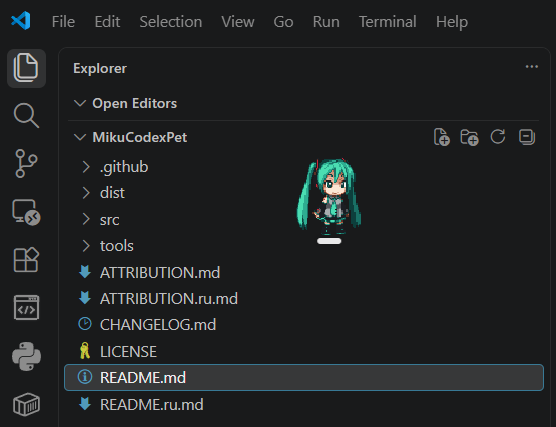

# Miku — нативный кастомный питомец для Codex 🎤 💚 🐾

[README in English](README.md)

Кастомный питомец (custom pet) для десктопного Codex/ChatGPT, собранный из оригинальных пиксель-арт спрайтов Хацунэ Мику из проекта [CharlesWiiFlowers/MikuPet](https://github.com/CharlesWiiFlowers/MikuPet).



> Неофициальный некоммерческий фанатский проект. Не аффилирован с Crypton Future Media, BYP Studio, Chaim Videogames, автором MikuPet и OpenAI и не одобрен ими. Арт персонажа не покрывается лицензией этого репозитория — см. [ATTRIBUTION.ru.md](ATTRIBUTION.ru.md).

Это не порт приложения MikuPet. Здесь нет ни Python-рантайма, ни Tkinter, ни `MikuPet.exe`, ни оверлея, ни отслеживания окон. Плавающим питомцем и его состояниями активности управляет сам Codex; этот репозиторий только конвертирует спрайты MikuPet в формат атласа, который ожидает Codex.

## 🔨 Сборка

```bash
pip install Pillow
python tools/build_codex_pet.py
```

Pillow — инструмент только для сборки. Это не требование исходного проекта (его рантайм здесь не воспроизводится — взяты только ассеты PNG/JSON) и не требование Codex, который получает `dist/miku/` как обычные данные и Python не запускает. Всё содержимое `dist/` уже собрано, поэтому для установки питомца зависимости не нужны вовсе — Pillow понадобится только если вы хотите пересобрать атлас из спрайтов; это же единственный способ заново прогнать проверки палитры, альфа-канала и геометрии из раздела [«Валидация»](#-валидация).

## 📦 Результат сборки

| Файл | Назначение |
| --- | --- |
| `dist/miku/pet.json` + `dist/miku/spritesheet.webp` + `dist/miku/CREDITS.txt` | **Готовый к установке пакет питомца** (десктопное приложение) |
| `dist/miku_codex_pet.png` | Атлас v2, 1536 × 2288, PNG с прозрачностью |
| `dist/miku_codex_pet.webp` | Атлас v2, WebP без потерь (те же пиксели) |
| `dist/miku_codex_pet_v1.png` | Атлас v1, 1536 × 1872, для загрузки через веб-интерфейс |
| `dist/preview/*.gif` | GIF-превью анимаций, только для отладки (Codex их не использует) |
| `dist/build-report.json` | Карта кадров, размещение по ячейкам, протокол валидации |

## 📐 Формат Codex

```text
spriteVersionNumber: 2
Размер листа:  1536 × 2288
Сетка:         8 столбцов × 11 строк
Размер ячейки: 192 × 208
Фон:           прозрачный (настоящая альфа, RGB прозрачных пикселей обнулён)
Формат:        PNG или WebP, ≤ 20 МиБ (у этого питомца — ~27 КБ)
```

> [!NOTE]
> Формат взят из скилла `hatch-pet`, поставляемого вместе с Codex (`~/.codex/skills/hatch-pet/references/codex-pet-contract.md` и `references/animation-rows.md`).

Строки 0-8 — стандартные состояния анимации, строки 9-10 — 16 направлений взгляда по часовой стрелке (`000` = вверх, `090` = вправо по экрану, `180` = вниз, `270` = влево по экрану), а ячейка (строка 0, столбец 6) содержит нейтральный кадр «взгляд прямо».

Лист v1 (`1536 × 1872`, только строки 0-8) собирается дополнительно, потому что **веб**-интерфейс загрузки, описанный на <https://learn.chatgpt.com/docs/pets>, до сих пор требует ровно 1536 × 1872. Для листа высотой 2288 обязателен `spriteVersionNumber: 2` — без него приложение откатывается к контракту v1 и отклоняет ассет.

## 💾 Установка

**Десктопное приложение (рекомендуется, v2):**

```bash
mkdir -p ~/.codex/pets/miku && cp dist/miku/pet.json dist/miku/spritesheet.webp dist/miku/CREDITS.txt ~/.codex/pets/miku/
```

В Windows PowerShell:

```bash
New-Item -ItemType Directory -Force "$env:USERPROFILE\.codex\pets\miku"; Copy-Item dist\miku\* "$env:USERPROFILE\.codex\pets\miku\" -Force
```

Затем в Codex: обновите список питомцев, выберите **Miku** и вызовите `/pet`, чтобы призвать плавающего питомца.

**Из архива:** к каждому релизу приложен `miku-codex-pet.zip` — архив, в корне которого лежит папка `miku/` с теми же тремя файлами. Распакуйте его в `~/.codex/pets/` (в Windows — `%USERPROFILE%\.codex\pets\`), и питомец установлен: ни Python, ни сборка не нужны.

**Веб (v1):** Settings → Personalization → Pet → Upload pet, загрузить `dist/miku_codex_pet_v1.png`.

## 🎞️ Раскладка анимаций

Каждая ячейка взята из реального кадра MikuPet — обрезана, масштабирована целым коэффициентом методом ближайшего соседа, дополнена прозрачными полями и переставлена. Ничего не перерисовывалось и не генерировалось.

| Строка | Состояние Codex | Источник | Примечания |
| --- | --- | --- | --- |
| 0 | `idle` | `idle` 0, 12, 13, 4, 6, 8 | Цикл дыхания с оригинальным миганием. Столбец 0 — статичный кадр для режима уменьшенной анимации. |
| 1 | `running-right` | `walk_right` 0-1-2-1-0-1-2-1 | Настоящий арт вправо; никаких отражений. |
| 2 | `running-left` | `walk_left` 0-1-2-1-0-1-2-1 | Настоящий арт влево; никаких отражений. |
| 3 | `waving` | `idle` 15, 16, 17, 16 | «Поющая» доля цикла idle с открытым ртом. |
| 4 | `jumping` | `walk_right` 0-1-2-1-0 | Позы середины шага, приподнятые на 5-8 px над базовой линией. |
| 5 | `failed` | `idle` 13, 12 | Глаза зажмурены, Мику оседает на несколько пикселей. |
| 6 | `waiting` | `idle` 15, 16, 17, 16, 15, 10 | Широко открытый рот и небольшое покачивание — «спрашивает». |
| 7 | `running` | `walk_right` 0-1-2-0-1-2 | Плотный цикл ходьбы. |
| 8 | `review` | `idle` 0, `walk_left` 1, `idle` 11, `walk_right` 1 | Мику осматривает работу — сначала влево, потом вправо. |
| 9-10 | направления взгляда | `walk_right` / `walk_left` / `idle` | Направления с правой составляющей смотрят вправо, с левой — влево; `000`/`180` откатываются к кадрам «лицом вперёд». |

Как это соотносится с состояниями активности Codex:

- **Running** → `running` (строка 7) — Мику идёт.
- **Needs input** → `waiting` (строка 6) — рот открыт, зовёт вас.
- **Ready** → `review` (строка 8) / `idle` (строка 0) — спокойна, смотрит по сторонам.
- **Blocked** → `failed` (строка 5) — глаза закрыты, поникла.
- **Reduced motion** → строка 0, столбец 0 — нейтральный кадр лицом вперёд.

## 📏 Геометрия

- Единый целочисленный масштаб 3× методом ближайшего соседа для всех состояний (исходные ячейки 64 × 100; итоговая высота Мику 189-192 px, что соответствует ~198 px встроенных питомцев Codex). 4× вышло бы за пределы ячейки 192 px.
- Каждый кадр анимации обрезается по *общему* для всей анимации ограничивающему прямоугольнику, поэтому сохраняется выравнивание, заданное оригинальным художником, и ни одно состояние не дёргается по горизонтали.
- Все состояния стоят на одной базовой линии (`y = 202`); единственные отклонения — намеренный подъём в прыжке и оседание в `failed`.

## ✅ Валидация

`tools/build_codex_pet.py` роняет сборку, если не выполнено хотя бы одно условие:

- оба атласа имеют размер строго 1536 × 2288 / 1536 × 1872 и формат RGBA;
- каждая используемая ячейка непустая, а каждая неиспользуемая — полностью прозрачная;
- ни один прозрачный пиксель не несёт ненулевой RGB;
- каждый цвет атласа уже присутствует в исходных спрайтах — точное совпадение палитры, что и доказывает отсутствие билинейной/бикубической интерполяции;
- ни один выходной файл не превышает лимит Codex в 20 МиБ.

Результат дополнительно проверен собственным валидатором Codex:

```bash
python ~/.codex/skills/hatch-pet/scripts/validate_atlas.py dist/miku/spritesheet.webp --require-v2
```

## ⚠️ Известные ограничения

- Анимация `dragging` из MikuPet не используется. Её растрёпанная поза имеет ширину 84 px в источнике, что при едином масштабе 3× даёт 252 px и не влезает в ячейку 192 px без обрезки волос или нарушения правила единого масштаба.
- В исходном наборе нет арта с видом сверху и снизу, поэтому направления взгляда `000` (вверх) и `180` (вниз) откатываются к кадрам «лицом вперёд» и различаются только состоянием глаз. Левое и правое направления при этом однозначны.
- `waving` и `waiting` оба опираются на кадры idle с открытым ртом; они отличаются таймингом и покачиванием, а не позой.

## 📜 Лицензия и благодарности

| Что | Условия |
| --- | --- |
| Инструменты сборки (`tools/`) и документация | GPL-3.0 — [LICENSE](LICENSE) |
| Метаданные анимаций MikuPet (`src/miku/*.json`) | GPL-3.0, скопированы без изменений из [MikuPet](https://github.com/CharlesWiiFlowers/MikuPet) |
| Спрайты персонажа (`src/miku/*.png`) и всё производное от них в `dist/` | **Не GPL-3.0** — права остаются у авторов арта |

```text
Ассеты персонажа:
BYP Studio и Chaim Videogames — Miku'n POP
Источник: The Spriters Resource / The VG Resource

Исходный проект спрайтов:
CharlesWiiFlowers/MikuPet (GPL-3.0)

Hatsune Miku (C) Crypton Future Media, INC. www.piapro.net
```

Переиспользование этих спрайтов с указанием авторства [публично разрешил Chaim Vester на itch.io](https://chaim-videogames.itch.io/mikun-pop#post-15508543) (19.02.2026) — это неформальное высказывание, а не лицензия, и оно говорит только за этого автора, но не за BYP Studio.

Это некоммерческое фанатское творчество, раздаётся бесплатно; арт используется как есть с указанием авторов, а не перелицензируется. Для коммерческого использования потребовалось бы разрешение правообладателей арта и Crypton — которого у проекта нет и которое он не может передать. Правообладатели могут [открыть issue](https://github.com/vkostyanetsky/MikuCodexPet/issues), и материалы будут удалены сразу.

Полная картина — хеши происхождения, уведомления GPL, заявление об изменениях — в [ATTRIBUTION.ru.md](ATTRIBUTION.ru.md).
